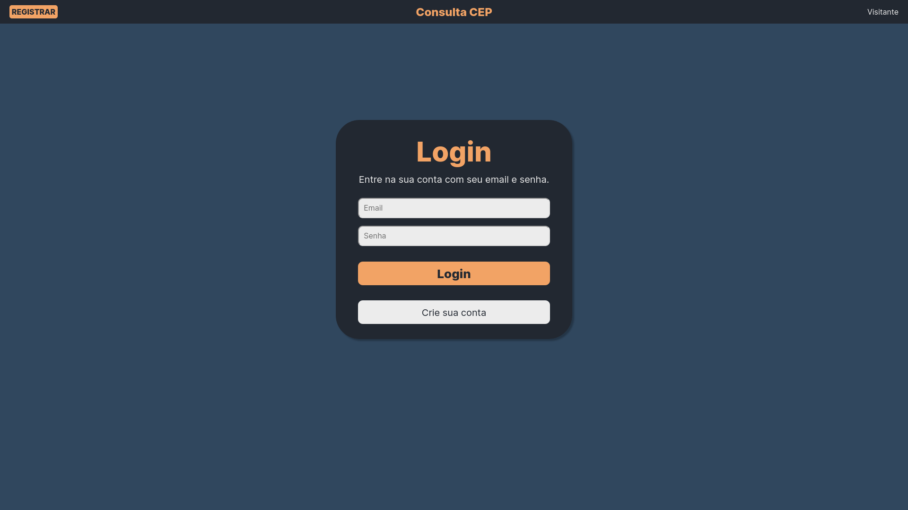
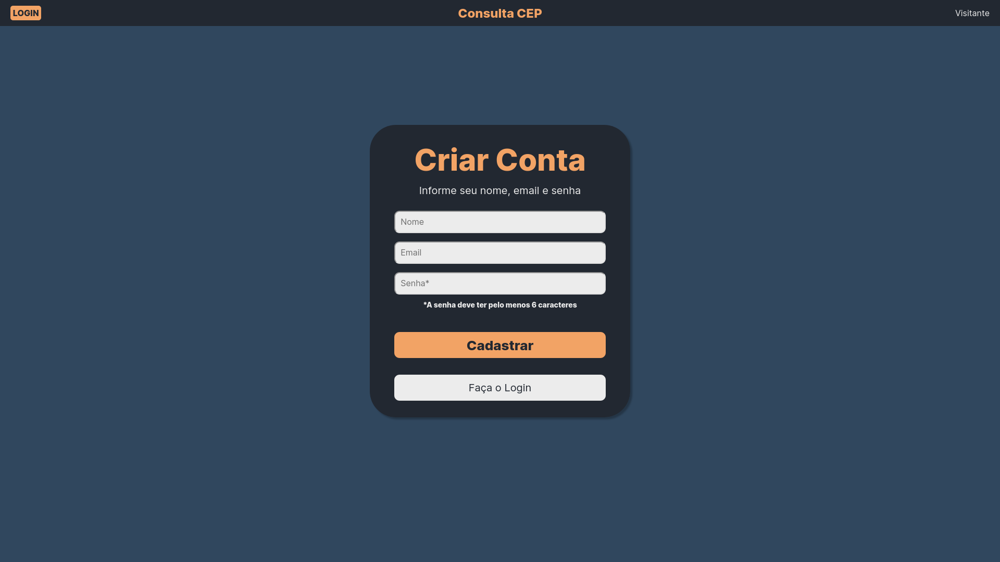
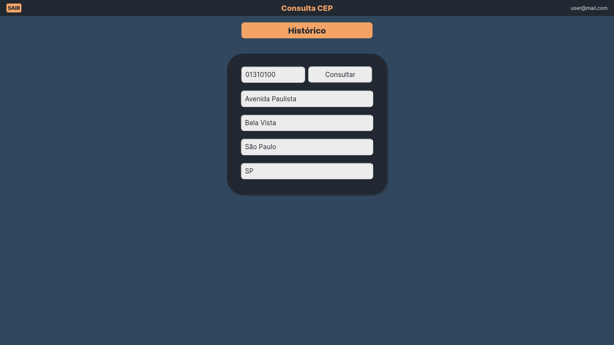
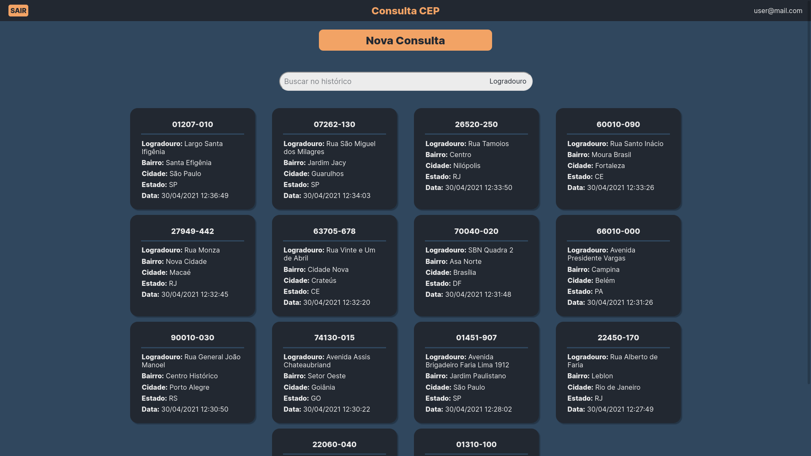
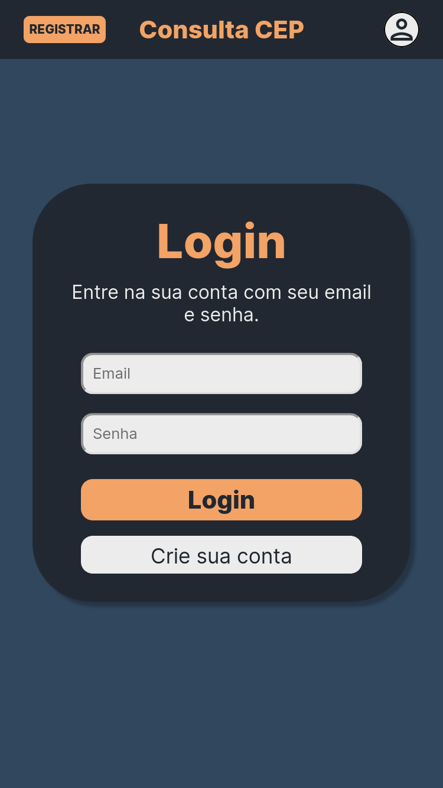
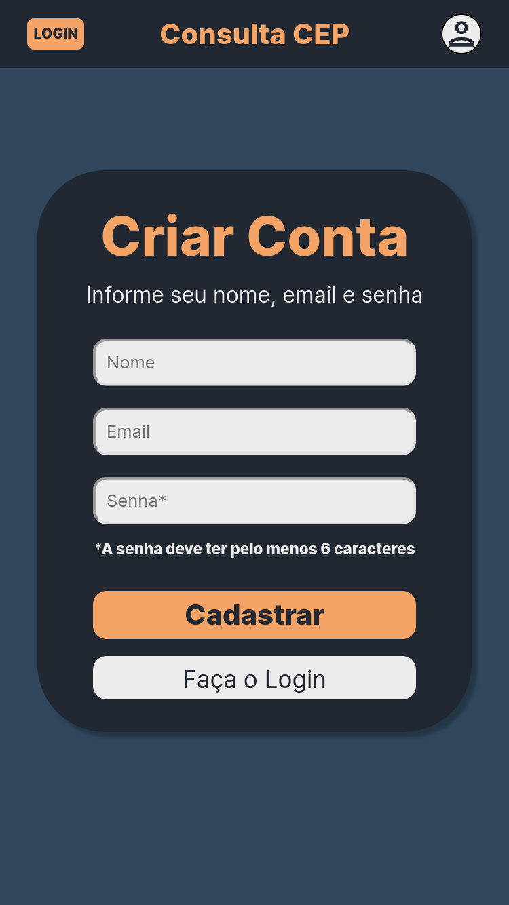
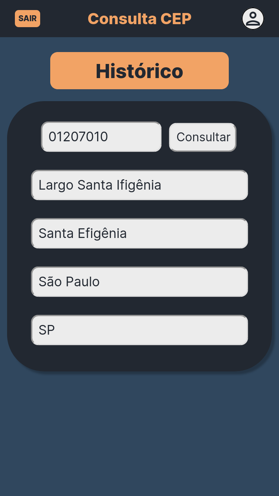
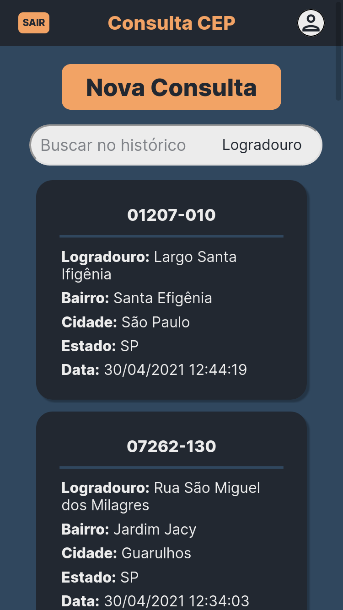

# 
<b style="font-size:70px">Consulta CEP</b>

## 
<b style="font-size:30px">Processo Seletivo ELO Jr 2021 - Grupo 2</b>

---

### <b style="font-size:20px">O que é?</b>

O projeto foi desenvolvido para a etapa final do processo seletivo da empresa ELO Jr e consiste em uma aplicação web com as funcionalidades de:
- Realizar um cadastro
- Fazer o login na aplicação
- Consultar CEPs diversos, retornando ao usuário o logradouro, o barrio, a cidade e a UF
- Consultar o histórico de buscas

---

### <b style="font-size:20px">Tecnologias utilizadas:</b>

<table border="0">
    <thead>
        <tr>
            <th><b style="font-size:20px">Frontend</b></th>
            <th><b style="font-size:20px">Backend</b></th>
            <th><b style="font-size:20px">API para consulta do CEP</b></th>
        </tr>
    </thead>
    </tbody>
        <tr>
            <td> Biblioteca React com Typescript</td>
            <td> Framework Spring Boot</td>
            <td> API do <a href="https://viacep.com.br/">ViaCep</a></td>
        </tr>
    </tbody>
</table>

---

### <b style="font-size:20px">Telas no Desktop:</b>

<b style="font-size:40px">Login</b>

<b style="font-size:40px">Registro</b>

<b style="font-size:40px">Consulta</b>

<b style="font-size:40px">Histórico</b>

---

### <b style="font-size:20px">Telas no Mobile:</b>

 

---

### <b style="font-size:20px">Desenvolvido por:
João Pedro S. Franco, João Víctor De Podestà e Lara Portilho Marques</b>
